<p align="center">
  
</p>

<p align="center">
  <a href="#start-in-2-minutes">Start in 2 minutes</a> ·
  <a href="#plugins">Plugins</a> ·
  <a href="#the-pr-factory">The PR factory</a> ·
  <a href="https://github.com/aishajv/ai-trainings">Learn the concepts</a>
</p>

# Welcome 👋

**Claude Everything is a free plugin marketplace for Claude Code**, built for Python and FastAPI teams.

Each plugin teaches Claude something your team would otherwise explain again and again: how to structure code, how to write tests, how to push a branch, how to design multi-tenant data. Install the ones you want, skip the rest, and Claude starts working your way from the first prompt.

New to skills, agents, or hooks? Start with [ai-trainings](https://github.com/aishajv/ai-trainings), a friendly, hands-on tour of the same setup.

## Start in 2 minutes

1. **Add the marketplace** in Claude Code:
   ```bash
   /plugin marketplace add aishajv/claude-everything
   ```
2. **Install a plugin**, for example:
   ```bash
   /plugin install fastapi-coding-conventions@claude-everything
   ```
3. **Just work.** Ask Claude to build something; the plugin's skills load on their own when they're relevant.

## Plugins

**Knowledge skills:** Claude follows these rules whenever the topic comes up.

| Plugin | What Claude learns |
|--------|--------------------|
| `fastapi-coding-conventions` | Architecture, naming, error handling, data contracts, and API design for Python/FastAPI + SQLAlchemy + Pydantic v2 |
| `fastapi-test-conventions` | Test pyramid, per-layer rules, factory patterns, conftest setup for pytest |
| `modular-monolith-architecture` | Bounded contexts, business ownership, public service-layer interfaces, module dependency control |
| `design-multi-tenant-saas` | Tenant resolution, PostgreSQL Row-Level Security, tenant-aware constraints |
| `llm-integration` | Reliable LLM calls: one injected client, validated structured output, bounded retries, rate limits, versioned prompts, cost limits, caching |
| `implementation-spec` | Implementation-ready specs for approved features: contracts, changes, failure behaviour, rollout, verification |
| `git-push-workflow` | Squash, rebase, push, and open a PR on GitHub or an MR on GitLab |

**Workflow plugin:** skills, agents, and a hook working together.

| Plugin | What it does |
|--------|--------------|
| [`feature-to-pr-factory`](plugins/feature-to-pr-factory/README.md) | Turns one feature into tickets, then builds each ticket into a reviewed, tested PR, with agents doing the work |

Install any of them the same way:

```bash
/plugin install <plugin-name>@claude-everything
```

## The PR factory

`feature-to-pr-factory` has two orchestrator skills that talk to you and hand the focused work to agents. One feature goes in; reviewed, tested pull requests come out.

<p align="center"></p>

- **Tests, forced by Claude Code:** a Stop hook runs `make test` whenever `ticket-implementer` tries to finish. It cannot finish until the tests pass; after 3 failed attempts it reports BLOCKED and you decide.
- **Review, run by the orchestrator:** `code-reviewer` and `test-reviewer` check each ticket in parallel. The orchestrator sends their critical issues back to the same implementer, at most twice, then asks you.
- **You merge:** each ticket becomes its own PR, stacked on the one it depends on, and the orchestrator keeps the stack rebased as you merge.

See the [plugin README](plugins/feature-to-pr-factory/README.md) for the full walkthrough.

## Prefer skills.sh?

The knowledge skills also install with [skills.sh](https://skills.sh), which works across AI coding tools:

```bash
npx skills add aishajv/claude-everything                       # all skills
npx skills add aishajv/claude-everything --skill llm-integration  # one skill
```

`feature-to-pr-factory` is plugin-only: its skills need its agents, and skills.sh installs skills only.

## Stack

Python 3.12+ · FastAPI · SQLAlchemy · Alembic · Pydantic v2 · pytest · factory_boy

<details>
<summary><b>Repository structure</b></summary>

```
claude-everything/
├── .claude-plugin/
│   └── marketplace.json       ← Claude Code marketplace catalog
├── assets/                    ← README visuals
├── plugins/                   ← Native Claude Code plugins
│   ├── design-multi-tenant-saas/
│   ├── fastapi-coding-conventions/
│   ├── fastapi-test-conventions/
│   ├── feature-to-pr-factory/
│   ├── git-push-workflow/
│   ├── implementation-spec/
│   ├── llm-integration/
│   └── modular-monolith-architecture/
└── skills/                    ← skills.sh format
    ├── design-multi-tenant-saas/
    ├── git-push-workflow/
    ├── implementation-spec/
    ├── llm-integration/
    ├── modular-monolith-architecture/
    ├── python-fastapi-coding-conventions/
    └── python-fastapi-test-conventions/
```

</details>

<details>
<summary><b>Maintaining</b></summary>

Every `plugin.json` has a `version`. Bump it in any PR that changes the plugin; otherwise installed users keep the old version.

</details>

<p align="center"><sub>Questions or ideas? <a href="https://github.com/aishajv/claude-everything/issues">Open an issue</a>. Happy building! ✨</sub></p>
