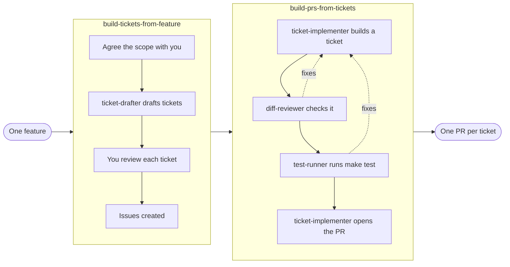

# Claude Everything

Reusable Claude Code skills for Python/FastAPI backend development, packaged as a native Claude Code plugin marketplace.

## Installation

### As a Claude Code plugin

```bash
# Add the marketplace
/plugin marketplace add aishajv/claude-everything

# Install individual plugins
/plugin install design-multi-tenant-saas@claude-everything
/plugin install modular-monolith-architecture@claude-everything
/plugin install implementation-spec@claude-everything
/plugin install fastapi-coding-conventions@claude-everything
/plugin install fastapi-test-conventions@claude-everything
/plugin install git-push-workflow@claude-everything
/plugin install llm-integration@claude-everything
/plugin install feature-to-pr-factory@claude-everything
```

### Via skills.sh

```bash
# All skills
npx skills add aishajv/claude-everything

# Specific skill
npx skills add aishajv/claude-everything --skill design-multi-tenant-saas
npx skills add aishajv/claude-everything --skill llm-integration
npx skills add aishajv/claude-everything --skill python-fastapi-test-conventions
npx skills add aishajv/claude-everything --skill modular-monolith-architecture
npx skills add aishajv/claude-everything --skill implementation-spec
```

`feature-to-pr-factory` is plugin-only: its skills need its agents, and skills.sh installs skills only.

## Plugins

| Plugin | Description |
|--------|-------------|
| `design-multi-tenant-saas` | Tenant resolution, PostgreSQL RLS, tenant-aware constraints, and privileged access |
| `modular-monolith-architecture` | Bounded contexts, business ownership, public service-layer interfaces, and module dependency control |
| `implementation-spec` | Technical specs for approved features: current contracts, API, data, service, and job changes, failure behaviour, rollout, and verification |
| `fastapi-coding-conventions` | Architecture, naming, error handling, data contracts, API design for Python/FastAPI + SQLAlchemy + Pydantic v2 |
| `fastapi-test-conventions` | Test pyramid, per-layer rules, factory patterns, conftest setup for pytest |
| `git-push-workflow` | Squash, rebase, push, and create MR for GitLab |
| `llm-integration` | Reliable LLM calls: one injected client, validated structured output, bounded retries, rate limits, versioned prompts, cost limits, caching |
| [`feature-to-pr-factory`](plugins/feature-to-pr-factory/README.md) | Turn one feature into tickets (`build-tickets-from-feature`), then build each ticket into a reviewed, tested PR (`build-prs-from-tickets`); includes the agents (plugin only). See its [README](plugins/feature-to-pr-factory/README.md) for how it works |

## The PR factory flow

`feature-to-pr-factory` has two orchestrator skills that talk to you and hand the focused work to subagents. One feature goes in; reviewed, tested pull requests come out.



## Stack

Python 3.12+ · FastAPI · SQLAlchemy · Alembic · Pydantic v2 · pytest · factory_boy

## Structure

```
claude-everything/
├── .claude-plugin/
│   └── marketplace.json       ← Claude Code marketplace catalog
├── plugins/                   ← Native Claude Code plugins
│   ├── design-multi-tenant-saas/
│   ├── fastapi-coding-conventions/
│   ├── fastapi-test-conventions/
│   ├── git-push-workflow/
│   ├── implementation-spec/
│   ├── llm-integration/
│   ├── modular-monolith-architecture/
│   └── feature-to-pr-factory/
└── skills/                    ← skills.sh format
    ├── design-multi-tenant-saas/
    ├── llm-integration/
    ├── modular-monolith-architecture/
    ├── implementation-spec/
    ├── python-fastapi-coding-conventions/
    ├── python-fastapi-test-conventions/
    └── git-push-workflow/
```

## Maintaining

Every `plugin.json` has a `version`. Bump it in any PR that changes the plugin; otherwise installed users keep the old version.
